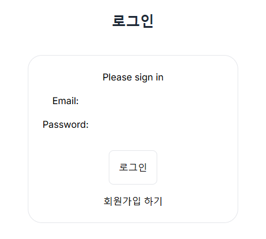
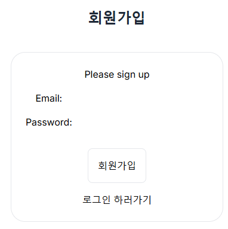
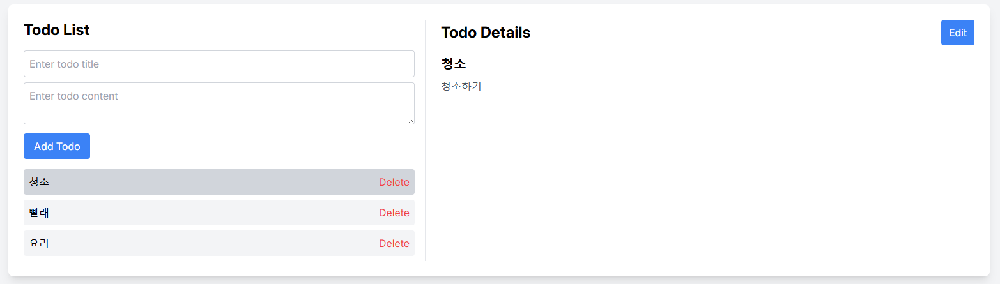

# 원티드 프리온보딩 FE 챌린지 11월

안녕하세요, 1년차 프론트 개발자입니다.

## 프로젝트 소개

기본적인 회원가입/로그인 기능, 투두 CRUD 기능을 구현했습니다.

많이 해본 기능이기도 하고, 평소에 SSR을 사용해본 적이 없어서 REMIX를 사용해봤습니다.

  
  
  

## 고민했던 점

1. 로그인 구현 시 브라우저에서 서버로 요청을 보내면 서버에서 다시 API 서버에 로그인을 요청해야하는데 이 부분이 어려웠다.

- 아이디, 비밀번호를 서버, API 서버에 걸쳐 전달하는게 일반적인지 의문이 들었음.
- API 서버에서 전달한 토큰을 클라이언트 서버 코드에서 처리하는 경우, 로컬 스토리지에 저장하는 것이 불가능해서 쿠키를 사용해서 토큰을 클라이언트에 전달하도록 구현

2. action, loader 와 같이 정해진 형식에 맞게 구현을 하다보니 오히려 컴포넌트를 나누거나 로직을 분리하는게 어렵게 느껴졌다. 아직 Remix가 익숙하지 않아서 그럴수도 있지만, 한 화면에서 여러 action을 보내야하는 경우와 같이 좀 더 복잡한 서비스를 구현한다면 오히려 코드가 더 복잡해질 수도 있겠다고 생각했다.
